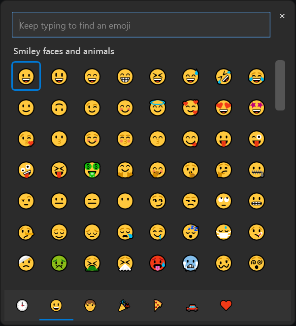

# Classic Emoji Picker

[](https://github.com/platima/Classic-EmojiPicker/actions/workflows/build.yml)
[](https://github.com/platima/Classic-EmojiPicker/actions/workflows/release.yml)
[](https://github.com/platima/Classic-EmojiPicker/releases/latest)
[](https://opensource.org/licenses/MIT)

A lightweight, standalone recreation of the Windows 10 emoji picker for Windows 11 users who prefer the simpler, cleaner interface without GIFs and bloated features.

<p align="center">
  
</p>

## ✅ Current Status: v0.1.6 - Working Release

This version includes core functionality and is ready for daily use:

- ✅ **Replaces Win+.** - takes over the emoji shortcut so it opens this picker instead of the built-in panel
- ✅ **Full Unicode emoji set** (~1,400 emoji) in the original seven Windows 10 categories
- ✅ **Opens where you're typing** - anchors to the text caret (mouse pointer fallback), like the Windows 10 panel
- ✅ **Direct insertion** - the selected emoji is typed into the app you were using
- ✅ **Dark mode** - automatically follows the Windows light/dark setting
- ✅ **Search by name or keyword** (e.g. "splash" finds 💦), focused and ready as soon as the picker opens
- ✅ **Keyboard driven** - arrow keys move the selection, Tab/Shift+Tab switch category, Enter inserts, ESC closes
- ✅ **Installer** with optional start-with-Windows

## Features

- **Clean Windows 10 Design** - Faithful recreation of the original Windows 10 emoji picker interface
- **Win+. Takeover** - Runs quietly in the system tray and opens on Win+. in place of the Windows 11 panel
- **The Original Seven Categories** - Recent, Smiley faces & animals, People, Celebrations & objects, Food & plants, Transportation & places, Symbols
- **Full Emoji Set** - Every renderable Unicode emoji from the database bundled with Emoji.Wpf (flags excluded, as in the Windows 10 picker)
- **Direct Insertion** - Picking an emoji types it into the previously focused window; falls back to copying to the clipboard when no target exists
- **Dark Mode** - Follows the system theme automatically and switches live when you change it
- **Recent Emojis** - Recently used emojis are remembered between sessions
- **Real-time Search** - Just start typing to filter emojis by name or keyword (e.g. "splash" finds 💦)
- **Keyboard Navigation** - Arrow keys move the highlighted emoji, Tab/Shift+Tab switch category, Enter inserts, ESC closes
- **Lightweight** - No unnecessary features, GIFs, or bloat; idles in the tray at ~20 MB
- **True Colour Emoji** - Rendered with [Emoji.Wpf](https://github.com/samhocevar/emoji.wpf) using the system Segoe UI Emoji font

## Requirements

- Windows 11 (or Windows 10 version 1809+)
- The full installer is self-contained - no separate .NET runtime is required (the lite installer needs the [.NET Desktop Runtime 8 x64](https://dotnet.microsoft.com/download/dotnet/8.0))
- For building from source: .NET 8 SDK and Visual Studio 2022 or VS Code with the C# extension

## Installation

### Option 1: Installer (recommended)

1. Download an installer from the [Releases](../../releases) page:
   - `EmojiPicker-Setup-<version>.exe` - **full**: includes the .NET runtime, needs nothing else (larger download)
   - `EmojiPicker-Setup-<version>-lite.exe` - **lite**: much smaller, but requires the [.NET Desktop Runtime 8 (x64)](https://dotnet.microsoft.com/download/dotnet/8.0) to be installed (setup checks for it and offers the download page if it's missing)
   - `ClassicEmojiPicker-<version>-win-x64.msi` - **MSI**: self-contained, installs per-machine; made for silent/enterprise deployment (see below)
2. Run it. The Setup.exe installers ask whether to install for **all users** (elevates, installs to Program Files) or **just you** (no administrator prompt).
3. Tick **Start with Windows** when asked so Win+. works after every sign-in.

<details>
<summary><strong>Silent / scripted installs</strong></summary>

Setup.exe (Inno Setup):

```powershell
# Per-user, silent, with start-with-Windows:
EmojiPicker-Setup-<version>.exe /VERYSILENT /SUPPRESSMSGBOXES /CURRENTUSER /TASKS=startup

# All users (run from an elevated shell for unattended use):
EmojiPicker-Setup-<version>.exe /VERYSILENT /SUPPRESSMSGBOXES /ALLUSERS /TASKS=startup
```

MSI (per-machine; ideal for Intune/GPO/scripts):

```powershell
msiexec /i ClassicEmojiPicker-<version>-win-x64.msi /qn            # install + start-with-Windows
msiexec /i ClassicEmojiPicker-<version>-win-x64.msi /qn AUTOSTART=0  # without the Run key
msiexec /x ClassicEmojiPicker-<version>-win-x64.msi /qn            # uninstall
```

Note: in an all-users/MSI install, autostart lives in HKLM. The tray icon's "Start with Windows" toggle manages a per-user (HKCU) entry independently; if both are set the second startup is a no-op (single-instance).

</details>

> **"Windows protected your PC" / SmartScreen warning?** The downloads aren't code-signed yet, so Windows may warn about an unrecognised app. Two ways past it:
> - **At the prompt:** click **More info**, then **Run anyway**.
> - **Before running:** right-click the downloaded file → **Properties** → tick **Unblock** (bottom of the General tab) → **OK**, then run it.
>
> The files are safe; this is Windows being cautious about new, unsigned downloads. Code signing is planned to remove the warning.

Classic Emoji Picker then lives in the system tray. Press **Win+.** anywhere to open it. Right-click the tray icon for **Open Emoji Picker**, a **Start with Windows** toggle, a **Debug logging** toggle (writes a diagnostic log to `%APPDATA%\ClassicEmojiPicker\debug.log` if you ever need to troubleshoot), and **Exit**.

> **Restoring the built-in panel:** while Classic Emoji Picker is running it intercepts Win+.. Choose **Exit** from the tray icon (and untick Start with Windows) to hand the shortcut back to Windows.

### Option 2: Build from Source

1. **Clone the repository:**
   ```bash
   git clone https://github.com/platima/Classic-EmojiPicker.git
   cd Classic-EmojiPicker
   ```

2. **Open in Visual Studio:**
   - Open `Classic-EmojiPicker.sln` in Visual Studio
   - Build → Build Solution (Ctrl+Shift+B)
   - Run → Start Debugging (F5)

3. **Alternative - Visual Studio Code:**
   - Open the project folder in VS Code
   - Use the .NET build commands or integrated terminal

## Usage

1. In any app, press **Win+.** (or double-click the tray icon) to open the picker at your text caret (falling back to the mouse pointer when the app doesn't expose a caret)
2. **Type** to search - the search box is focused from the start
3. **Browse** categories with **Tab / Shift+Tab** (or click the tabs at the bottom); move the highlight with the arrow keys
4. **Press Enter** (or click an emoji) to insert it into the app you were using
5. If there is no target window, the emoji is copied to the clipboard instead

The picker hides after inserting an emoji (or when it loses focus, or on ESC) and waits in the tray for the next Win+.. Recently used emojis are saved to `%APPDATA%\ClassicEmojiPicker\recent.json` and shown in the Recent tab 🕒.

## How the Win+. takeover works

The app installs a low-level keyboard hook that catches Win+. before the Windows shell does, opens this picker, and swallows the keystroke so the built-in panel doesn't also appear. This means the app must be running (it sits in the tray) for the shortcut to work - the installer's **Start with Windows** option keeps it available after every sign-in.

### Known limitations

- **Elevated (run-as-administrator) apps**: Windows does not deliver keystrokes destined for elevated windows to a non-elevated hook, so pressing Win+. inside an elevated app opens the **built-in** Windows panel instead of this picker. Similarly, emoji can't be typed into an elevated window from here - picking one for an elevated target copies it to the clipboard instead. (Fixing this would require running the picker elevated or shipping a signed UIAccess binary - both worse trades than the limitation.)
- **Caret anchoring** relies on the target app exposing a system caret; apps that don't (some frameworks) fall back to opening at the mouse pointer.

## Emoji Rendering

Colour emoji rendering is handled by the [Emoji.Wpf](https://github.com/samhocevar/emoji.wpf) library, which uses the system's Segoe UI Emoji font (present on all supported versions of Windows). No bundled fonts are required.

## Development

### Project Structure
```
EmojiPicker/
├── MainWindow.xaml(.cs)     # Picker UI + emoji/keyboard/insertion logic
├── App.xaml(.cs)           # Tray host: single instance, hook, theme, lifecycle
├── HotkeyListener.cs       # Global Win+. keyboard hook (WH_KEYBOARD_LL)
├── TextInjector.cs         # Types the emoji into the previously focused window
├── ThemeManager.cs         # Follows the Windows light/dark setting
├── Theme/                  # LightTheme.xaml / DarkTheme.xaml brush dictionaries
├── Resources/app.ico       # Application + tray icon
└── Properties/AssemblyInfo.cs
installer/
└── EmojiPicker.iss         # Inno Setup script (built in the release workflow)
```

### Code Quality & Standards

The project follows enterprise-grade code quality practices:

#### **Formatting & Style**
- **EditorConfig** (`.editorconfig`) - Enforces consistent code formatting
- **C# Conventions** - PascalCase naming, 4-space indentation
- **Auto-formatting** - `dotnet format` for automatic code cleanup

#### **Code Analysis**
- **Static Analysis** - .NET analyzers enabled with latest rules
- **Build Validation** - Warnings and errors caught during build
- **Performance Checks** - Memory and startup optimisation validation

#### **Quality Assurance Tools**
```powershell
# Local code quality check (equivalent to cppcheck)
.\code-quality-simple.ps1

# Auto-fix formatting issues
dotnet format

# Manual detailed analysis
dotnet build --configuration Release --verbosity normal
```

#### **CI/CD Integration**
- **GitHub Actions** - Automated build and quality checks
- **Release Workflow** - Quality gates before releases
- **Format Verification** - Prevents improperly formatted code

### Emoji Data

The emoji list is not hardcoded: it comes from the Unicode emoji database embedded in Emoji.Wpf (`EmojiData.AllGroups`), filtered to emoji the system font can render.

### Categories

The Unicode groups are mapped onto the original Windows 10 categories in `GroupToCategory` in `MainWindow.xaml.cs`:
- 🕒 **Recent** - Most recently used (persisted)
- 😀 **Smileys** - Smileys & Emotion + Animals & Nature
- 👤 **People** - People & Body
- 🎉 **Celebrations** - Activities + Objects
- 🍕 **Food** - Food & Drink + plants
- 🚗 **Transport** - Travel & Places
- ♥️ **Symbols** - Symbols

Flags are excluded, matching the Windows 10 picker.

## Contributing

We welcome contributions! Please follow these guidelines:

### **Development Setup**
1. Fork the repository
2. Clone your fork: `git clone https://github.com/platima/Classic-EmojiPicker.git`
3. Open in Visual Studio 2022 or VS Code
4. Ensure .NET 8 SDK is installed

### **Code Quality Standards**
Before submitting, ensure your code meets quality standards:

```powershell
# Run full quality check
.\code-quality-simple.ps1

# Fix formatting automatically
dotnet format

# Build and test
dotnet build --configuration Release
```

### **Contribution Workflow**
1. Create a feature branch (`git checkout -b feature/amazing-feature`)
2. Make your changes following the coding standards
3. Run code quality checks locally
4. Commit your changes (`git commit -m 'Add amazing feature'`)
5. Push to the branch (`git push origin feature/amazing-feature`)
6. Open a Pull Request

### **Pull Request Guidelines**
- ✅ Code quality checks must pass
- ✅ Follow existing code style (enforced by EditorConfig)
- ✅ Add appropriate comments and documentation
- ✅ Keep changes focused and atomic
- ✅ Update CHANGELOG.md if needed

### **Code Style**
- **Language**: C# 12 with modern features
- **Formatting**: Enforced by `.editorconfig` and `dotnet format`
- **Naming**: PascalCase for public members, camelCase for private
- **Comments**: Australian English, clear and concise
- **Performance**: Keep the resident (idle-in-tray) footprint modest

## Roadmap

### v0.2.0 (Next Release)
- [x] Add more emoji categories (Animals, Food, Travel, etc.)
- [x] Expand emoji database with more emojis
- [x] Improved error handling and user feedback (crash-surviving resident app, opt-in debug logging)

### v0.3.0 (Future)
- [x] Global hotkey support (Win+. replacement)
- [x] Dark mode
- [x] Installer/packaging for easy distribution
- [x] Auto-start with Windows option
- [ ] Skin tone modifiers for people emojis
- [x] Search by keyword/alias (matches emoji names and keyword tags)

### v1.0.0 (Stable Release)
- [ ] Settings/preferences window
- [ ] Configurable hotkey

## License

This project is licensed under the MIT License - see the [LICENSE](LICENSE) file for details. Third-party components and their licences are listed in [THIRD-PARTY-NOTICES.md](THIRD-PARTY-NOTICES.md).

## Acknowledgments

- Original Windows 10 emoji picker design by Microsoft
- Colour emoji rendering by [Emoji.Wpf](https://github.com/samhocevar/emoji.wpf) (Sam Hocevar)
- Grid virtualization by [VirtualizingWrapPanel](https://github.com/sbaeumlisberger/VirtualizingWrapPanel) (S. Bäumlisberger)
- Search keyword data from [emojibase](https://github.com/milesj/emojibase) (MIT), derived from Unicode CLDR
- Built with WPF and .NET 8.0

## Why This Project?

Windows 11's emoji picker became bloated with GIFs, reactions, and other features that many users don't need. This project brings back the simple, clean interface of Windows 10's emoji picker for users who just want to quickly find and copy emojis.
